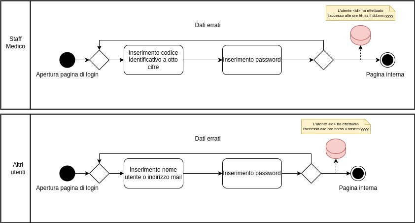

# _Mentcare Demo_

# Indice

# 1 - Introduzione

Mentcare è un sistema informativo utile per la gestione di cliniche che trattano pazienti con problemi di salute mentale.
Esso dovrà fornire un insieme di metodi e strumenti necessari per la raccolta, conservazione e utilizzo dei dati
correlati all'attività informativa di una o più cliniche responsabili di pazienti mentalmente instabili che non necessitano di ospedalizzazione.
Sono dunque presi in cura da cliniche specializzate dove possono trovare un dottore che conosce attentamente il loro stato clinico.
Il suo scopo è gestire lo scambio di informazioni fra le varie componenti interne attraverso una banca dati centrale.

# 2 - Background

## 2.1 - Processo di sviluppo software

In questa sezione riportiamo le fasi di sviluppo del sw e eventualmente particolari
scelte o condizioni in cui ci siamo trovati

# 3 - Analisi dei requisiti
(In teoria dagli scenari tiriamo fuori gli stakeholder (?))
## 3.1 - Stakeholder 

Gli attori partecipanti al sistema sono:

- Pazienti
- Dottori
- Infermieri
- Visitatori a domicilio
- Addetti alla reception
- Staff di amministrazione

## 3.2 - Specifica

### 3.2.1 - Scenari

#### S1 - IL MEDICO EFFETTUA UNA PRESCRIZIONE

Assunzione iniziale: Il medico effettua una prescrizione per uno o più pazienti da lui in cura; in particolare, tramite il login nel 
sistema, inserendo il codice ID a 8 cifre e la password di sicurezza, sarà visualizzata la schermata principale.

Normale: il medico, una volta effettuato il login, clicca sul bottone "Visualizza Pazienti" in cui visualizza l'elenco dei pazienti da lui in cura dove sono presenti nome e cognome.
Il medico decide di visualizzare la cartella clinica del paziente a cui effettuare la prescrizione medica, così clicca sull'icona a forma di foglia in corrispondenza del nome.
Una volta visualizzata, il medico clicca sul bottone "Nuova Prescrizione Medica" e viene reindirizzato a una schermata per l'inserimento della nuova prescrizione medica unica relativa a quel paziente. 
Allora, su un campo di testo scrive le proprie indicazioni e tramite una schermata interna di ricerca digita il nome del farmaco che sta prescrivendo, 
seleziona il farmaco che sarà inserito nella prescrizione e in un campo di testo inserisce il dosaggio.
Una volta completata la prescrizione medica conferma l'operazione cliccando sul bottone "Conferma" ed un pop up gli chiede ulteriore conferma. 

Cosa può andare storto: 
- Il farmaco non è presente e cliccando su di esso appare una notifica di errore. 
- Il medico decide di non effettuare più la prescrizione, così cliccando sul pulsante "Annulla" l'operazione di 
  prescrizione viene annullata e viene reindirizzato alla schermata principale.
- Il medico vuole effettuare una nuova prescrizione ad un paziente che già ne possiede una e viene allora visualizzata una schermata con la relativa notifica di errore.
- Il dosaggio non rientra nel range di sicurezza e il sistema genera una notifica di errore chiedendo di inserire il valore atteso. 

Altre attività: il medico visualizza la lista dei farmaci appena prescritti al paziente e i relativi dosaggi e dopo aver visualizzato l'elenco dei 
pazienti e selezionato il paziente, clicca sul bottone "Visualizza Farmaci".

Stato di completamento: La nuova prescrizione è stata completata ed è visibile all'interno della cartella clinica.

#### S2 - IL MEDICO AGGIORNA UNA PRESCRIZIONE 

Assunzione iniziale: Il medico effettua un aggiornamento della prescrizione medica per uno o più pazienti da lui in cura;
effettua il login nel sistema inserendo il codice ID a 8 cifre e la password di sicurezza e viene visualizzata la schermata principale.

Normale: Il medico clicca sul bottone "Modifica Prescrizione" e viene visualizzato l'elenco dei pazienti da lui in cura 
con il rispettivo nome e cognome accanto al quale è presente un'icona a forma di martello. Il medico decide di effettuare l'aggiornamento
della prescrizione e clicca sull'icona. Viene così reindirizzato a una schermata per l'inserimento della modifica della prescrizione 
unica relativa al paziente. Il medico visualizza il campo di testo in cui sono presenti le indicazioni sulla prescrizione con i relativi 
farmaci prescritti e il loro dosaggio. Allora modifica il campo di testo e il dosaggio cliccando su di essi e per eliminare
i farmaci prescritti clicca sul bottone "X" di fianco; il medico inoltre inserisce un nuovo farmaco interagendo con una
schermata interna di ricerca in cui digita il nome del farmaco in un'apposita barra e cliccando sul nome del nuovo farmaco 
sarà selezionato e inserito nella prescrizione. Una volta completato l'aggiornamento della prescrizione medica conferma l'operazione cliccando
sul bottone "Conferma" e un pop up gli chiede ulteriore conferma.

Cosa può andare storto:
- Il farmaco non è presente e cliccando su di esso appare una notifica di errore.
- Il medico decide di non effettuare più l'aggiornamento della prescrizione così clicca sul pulsante "Annulla", l'operazione di
aggiornamento viene annullata e viene reindirizzato alla schermata principale.
- Il dosaggio non rientra nel range di sicurezza allora il sistema genera una notifica di errore chiedendo d'inserire il valore atteso.

Altre attività: il medico visualizza la lista dei farmaci assunti dal paziente e i relativi dosaggi e, dopo 
aver visualizzato l'elenco dei pazienti e averlo selezionato, clicca sul bottone "Visualizza Farmaci".

Stato di completamento: L'aggiornamento della prescrizione è stato completato ed è visibile all'interno
della cartella clinica. 

#### S3 - Ingresso di un nuovo paziente in clinica

Assunzione iniziale: L'infermiere incaricato effettua il login inserendo il codice identificativo otto cifre
e la propria password e viene visualizzata la schermata principale.

Normale: L’infermiere clicca sul bottone “Nuovo ricovero” e viene visualizzata una schermata in cui inserisce gli 
estremi del paziente e lo stato di pericolosità spuntando o meno la casella “Paziente pericoloso". Il paziente non 
pericoloso viene informato dei propri diritti inerenti il ricovero e le proprie azioni; successivamente l’infermiere 
inserisce i dati anagrafici, seleziona il medico che lo riceverà in cura e clicca sul bottone “avanti” e un pop 
up chiede conferma di detenzione. L’infermiere, fatto ciò, clicca sul bottone “Conferma detenzione” registrando così la decisione 
di detenzione. Il paziente viene allora ricoverato nella clinica e un messaggio di notifica di detenzione con le 
informazioni rispettivamente del paziente e del medico curante viene inviata ai servizi sociali e al medico che lo avrà in cura.

Cosa può andare storto:
- L’infermiere decide di annullare l’operazione di ricovero forzato, clicca sul tasto “Annulla” e 
viene reindirizzato alla schermata principale;
- L’infermiere non inserisce un campo dei dati anagrafici, una notifica di errore viene generata e cliccando su “Ok” 
viene reindirizzato alla schermata per il nuovo inserimento dei dati anagrafici.

Altre attività:
- L’infermiere deve ricoverare un paziente pericoloso, allora spunta la casella “Paziente pericoloso”. L’infermiere 
clicca sul bottone “Avanti” e una schermata gli mostra gli ospedali disponibili per la cura del paziente. 
In questa schermata, spunta l’ospedale, clicca su “Conferma detenzione” e una notifica di trasferimento viene inviata all'ospedale selezionato.
- L’infermiere deve ricoverare un paziente pericoloso e spunta la casella “Paziente pericoloso”. L’infermiere 
clicca sul bottone “Avanti” e una schermata mostra che non c'è alcun ospedale disponibile in cui poter effettuare 
il trasferimento del paziente. Così, un pop up notifica la mancata disponibilità degli ospedali. Nel caso in cui l'infermiere 
conferma la detenzione, cliccando su “Conferma Detenzione” una notifica di trasferimento viene inviata alla stazione di polizia.

Stato di completamento: La procedura di ricovero forzato è stata completata e il nuovo paziente e suoi dati 
sono visibili e reperibili negli elenchi a disposizione del personale medico; inoltre, viene aggiornato lo storico 
“notifiche inviate” visibile dal personale amministrativo e lo storico “notifiche ricevute" visibile dal medico che 
riceve in cura il paziente.

"NOTA-> LASCIO LE RIGHE A SEGUIRE PER INFORMAZIONI CHE POTRANNO ESSERE UTILIZZATE A SEGUITO"
Una volta effettuato il login, l’infermiere, scegliendo l’opzione “Registrazione utente”, dovrà inserire i seguenti campi richiesti:

- Codice fiscale
- Nome
- Cognome
- Nome e cognome del medico curante
- Allergie

  Se qualcuno dei campi relativi non è valido, comparirà un messaggio di errore per ciascuno dei possibili casi:
1. Il nome e il cognome del medico curante non risultano validi;
2. Nel caso in cui il codice fiscale è già presente nel database, questo risulterà non valido;
3. Nel caso in cui ci sia incongruenza tra il codice fiscale e l’anagrafica che lo compone, i campi inseriti non risulteranno validi.
4. Nel caso in cui il codice fiscale sia troppo corto o troppo lungo, non è valido. Dopo il messaggio di errore, sarà possibile modificare i campi errati e riconfermare.

Una volta inseriti tutti i campi l'infermiere può confermare l'operazione premendo il pulsante "Conferma", allora una finestra pop-up comparirà a schermo con i due pulsanti "Conferma" e "Annulla".
Se viene cliccato "Conferma" il paziente viene registrato, se clicca "Annulla" torna alla schermata precedente.
Altrimenti l'infermiere può annullare l'operazione di registrazione nuovo paziente cliccando "Annulla" e tornando alla schermata precedente.

#### S4 - Un infermiere deve somministrare un farmaco ad un paziente

L’infermiere effettua il login nel sistema inserendo il suo codice ID a 8 cifre e la password di sicurezza, cliccando sulla sezione “pazienti odierni” visualizza l’elenco dei pazienti oggi in visita in struttura, 
seleziona il paziente con un click. Dopo il click visualizza il farmaco da somministrare, se disponibile, la dose da somministrare al paziente e la frequenza di dosaggio. L’infermiere può:

- Somministrare il farmaco: l’infermiere clicca sul bottone “somministrazione effettuata”. Allora un pop up chiede all’infermiere di confermare o meno l’operazione:

1. Se l'infermiere clicca sul pulsante "Conferma" l’operazione viene confermata e il campo “somministrazione odierna” viene visualizzato 
con un pallino verde accanto all voce e il sistema ritorna all’elenco dei pazienti odierni.
2. Se l'infermiere clicca sul pulsante "Annulla" l’operazione non viene confermata lo stato della “somministrazione odierna” 
non viene modificato, quindi sarà visualizzato un pallino rosso accanto alla voce "Somministrazione Odierna" e il sistema 
ritorna all’elenco dei pazienti odierni.

- Non somministrare il farmaco: clicca sul bottone “Annulla” e ritorna all’elenco dei pazienti odierni.

#### S5 - L'infermiere registra un nuovo paziente pericoloso

#### S6 - Il receptionist registra un nuovo appuntamento.

Il receptionist una volta effettuata la fase di login, è reindirizzato alla schermata principale, per inserire un nuovo appuntamento cliccherà sul pulsante "Nuovo Appuntamento". 
Una volta effettuato il click comparirà una schermata all'interno della quale sarà chiesto d'inserire il codice fiscale del paziente e poi tramite un menù a tendina selezionerà il 
medico che effettuerà la vista.
- Se il receptionist inserisce in modo errato il codice fiscale, comparirà un messaggio di errore in cui sarà richiesto d'inserire nuovamente il codice fiscale corretto;
- ->Se il receptionist inserisce correttamente il codice fiscale ma non seleziona il medico che effettuerà la visita il sistema genera un pop up
con un messaggio di errore in cui viene segnalato d'inserire il medico.
- ->Se il receptionist inserisce correttamente e seleziona correttamente il medico, cliccando sul pulsate "Continua" sarà reindirizzato in una 
pagina in cui dovrà inserire i dettagli dell’appuntamento; invece cliccando sul pulsante "Indietro" ritorna alla schermata principale.

Quando il receptionist avrà inserito correttamente tutti i dati e il cliccato sul pulsante "Conferma" apparirà una schermata di riepilogo appuntamento.

#### S7 - Il receptionist cancella un appuntamento 

#### S6 - Un utente visualizza i propri appuntamenti.

Un utente, una volta effettuato il login, può visualizzare gli appuntamenti tramite la sezione “visualizza appuntamenti”.
Si possono verificare i seguenti casi:
-  Se l’utente è un paziente / medico, può visionare solo i propri appuntamenti;
-  Se l’utente è un receptionist, può visualizzare la lista di tutti gli appuntamenti della clinica;
-  Se l’utente è un infermiere a domicilio, può visualizzare la propria lista di appuntamenti.

#### S8 - Caso report mensile da generare.

Il sistema, alla fine di ogni mese, dopo le 17:30, genera un report sottoforma di raccolta dati che enuncia le seguenti informazioni:
- Numero di pazienti per clinica;
- Numero dei pazienti inseriti e cancellati nel sistema;
- Numero di pazienti per sintomatologia con annessi farmaci prescritti;
- I farmaci prescritti vengono arricchiti con i dati relativi alle dosi fornite e i costi ad essi associati.

#### S9 - Caso ispezione giudiziaria o indagine di polizia.

È possibile, durante un’ispezione giudiziaria o un’indagine di polizia che venga richiesto l’accesso ai dati sensibili degli utenti. In particolare, il richiedente ottiene un file con i dati del singolo paziente oppure con un sommario di tutti i pazienti della clinica. Lo staff di amministrazione troverà di fronte a sé un registro dei pazienti con annessi i due bottoni che svolgono rispettivamente queste funzionalità. Una volta selezionata la modalità, viene mostrata a schermo una finestra di conferma.
Se lo staff di amministrazione sbaglia ad inserire il nome dell’utente ricercato, il registro mostrerà una schermata vuota.

#### S9 - Logout di un utente. ******** 
(EMANUEL - SECONDO ME DA LEVARE, E' UNA SINGOLA AZIONE)
Un utente qualsiasi, una volta entrato nel sistema attraverso la metodologia d’accesso, ha la possibilità di poter effettuare il logout in qualsiasi momento andando nell’apposita sezione in alto a destra e selezionando la voce “Logout” specificato su un bottone. Un volta che il bottone viene premuto, viene effettuata l’operazione e l’utente sarà disconnesso dal sistema.

### 3.2.2 - Requisiti funzionali per attori

(a) Medici

- (a.1) Un medico può aggiornare la prescrizione dei farmaci di ogni paziente da lui in cura (S2)
- (a.2) Un medico può prescrivere farmaci a ogni paziente da lui in cura (S1)
- (a.3) Un medico può visualizzare la cartella clinica del paziente (S1)
- (a.4) Un medico può visualizzare la lista di farmaci somministrati da ogni paziente da lui in cura (S1)
- (a.5) Un medico può visualizzare la lista dei propri appuntamenti (S6)
- (a.6) Un medico può ricercare l'appuntamento con un determinato paziente inserendo il relativo codice fiscale (S6)
- (a.7) Un medico può inserire i farmaci a un paziente a lui associato (S1)

(b) Infermieri

- (b.1) Un infermiere può visualizzare la lista con le informazioni di tutti i suoi pazienti
- (b.2) Un infermiere ha la possibilità di cercare i pazienti in base al codice fiscale
- (b.3) Un infermiere può visualizzare la lista di farmaci assunti da ogni paziente

(c) Pazienti
- (c.1) Un paziente può visualizzare il proprio calendario farmacologico
- (c.2) Un paziente può visualizzare la lista dei propri appuntamenti sul calendario
- (c.3) Un paziene può visualizzare le dosi che deve assumere per ogni farmaco avendo la possibilità di filtrare ogni farmaco in base al nome
- (c.4) Un paziente può visualizzare il report di resoconto di una certa visita

(d) Addetto alla reception
- (d.1) Un receptionist può registrare e modificare gli appuntamenti inserendo il codice fiscale del paziente e del personale medico
- (d.2) Un receptionist può visualizzare la lista di tutti gli appuntamenti filtrando le ricerche inserendo l'id del paziente

(e) Staff di amministrazione
- (e.1) Un membro dello staff di amministrazione ha accesso ad un' area riservata dove può ricercare un utente e stamparne il report

### 3.2.3 Requisiti funzionali di sicurezza

- Il sistema deve garantire la protezione dei dati coperti da 
privacy in modo che solamente lo staff medico e il paziente
possano avervi accesso
- Gli utenti che possono accedere ai report devono essere riportati su una white list
- Solo l'utente che apre il record può modificarlo
- Ogni membro dello staff deve essere identificato da un codice univoco di 8 cifre

### 3.2.4 Requisiti funzionali safety

- Il sistema deve avvertire lo staff medico circa la pericolosità di una particolare patologia del paziente se essa è presente
- Il sistema effettua un controllo sulle dosi dei farmaci basandosi su un range di sicurezza. In caso di errore la dose deve essere reinserita
- Se il paziente soffre di allergie particolari il sistema deve rispondere alla somministrazione di un farmaco scorretto con un messaggio di warning e se la figura che prescrive ignora il messaggio di warning deve essere obbligato a lasciare una ragione scritta del perchè

### 3.2.5 Requisiti funzionali riguardanti interfaccia grafica

- Il sistema deve mostrare i record dei pazienti
- Il sistema deve essere dotato di un medication field
- Il sistema deve poter consentire la selezione delle voci 'current medication','new medication' e 'formulary'
- Se si sceglie 'current medication' il sistema chiede un check della dose, la dose può anche essere cambiata
- Se si sceglie 'new medication' il medico può effettuare una ricerca scrivendo anche solo parzialmente le lettere del farmaco
- Se si sceglie 'formulary' il sistema mostra una search box in cui cercare il farmaco e viene effettuato un check circa la validità della medicazione, viene inserita la dose anche in questo caso
- Dopo che il medico ha fatto tutta la procedura, il sistema notifica una schermata di check riassuntiva laddove sono presenti i bottoni 'Ok' e 'Modifica'
- Durante il check di dose serve un pulsante 'Conferma'
- un utente dovrebbe avere la possibilità di vedere gli appuntamenti relativi ed effettuare ricerche su di essi
- Il sistema deve notificare i dottori online con un menù a cascata
- Il sistema deve essere dotato di una chat fra i dottori online

### 3.2.5 Requisiti funzionali di automazione
- Per ogni nuova prescrizione medica, o aggiornamento, il sistema aggiorna la data della prescrizione in cartella clinica. 
- Il sistema genera un report mensile mostrando il numero di pazienti per clinica, il numero dei pazienti inseriti o cancellati dal sistema,il numero di pazienti per tipologia, i farmaci loro prescritti ed i relativi costi, questo l'ultimo giorno *lavorativo* del mese, dopo le 17:30
- Il report deve contenere anche le seguenti informazioni: nomi dei farmaci,numero di prescrizioni,numero di dosi prescritte e costi totali delle dosi prescritte
- Se il report ha dosi di differenti unità(10mg,20mg), il sistema deve registrarle in report separati per ogni unità
- il sistema deve generare una lista dei pazienti attesi quel giorno, per ogni clinica

### 3.2.6 Altri requisiti funzionali

- Il sistema prevede sommari dei dati che possano essere facilmente interpretabili dai medici in velocità (problemi chiave e trattamenti iniziati)
- Le informazioni vanno raccolte all'interno di un database centrale a cui differenti host hanno accesso copiandone le informazioni dalla fonte principale
- Ogni farmaco deve possedere i campi 'Maximum dose' e 'Minimum dose'
- Gli addetti alla reception devono poter trasferire i dati di un paziente da un database ad un altro(PSR), come informazioni di tipo anagrafico o sommari di diagnosi e trattamenti di pazienti, lo scambio in sè va regolato secondo il metodo
  di handshacking (il sistema deve essere in grado di ricevere una risposta positiva dal PSR)

### 3.2.7 Requisiti non funzionali

- Il sistema Mentcare dove essere disponibile a tutte le cliniche durante le normali ore lavorative
  (LUN-VEN 8:30-17:30)
- Il sistema non deve riavviarsi se non in 5 o meno secondi
- Tutti gli utenti del sistema devono potersi autenticare con la tessera sanitaria
- Il sistema deve rispettare le linee guida per la privacy in HStan-03-2006-priv
- Gli errori utente (come ad esempio segnalazioni) devono essere comunicati in modo semplice e minimizzati

## 3.4 - Diagrammi di casi d'uso

### 3.4.1 - Casi d'uso del Medico

### 3.4.2 - Casi d'uso dell'infermiere

### 3.4.3 - Casi d'uso del paziente

### 3.4.4 - Casi d'uso dell' addetto alla reception

### 3.4.5 - Casi d'uso dello staff di amministrazione

### 3.4.6 - Casi d'uso degli infermieri a domicilio

## 3.5 - Definizione degli stati del sistema

Una volta definiti degli stati o delle operazioni chiave fatti dagli utenti,
è possibile attribuire responsabilità ai vari utenti di queste ultime.

IPOTESI DI ALE CIRCA GLI STATI DEL SISTEMA CHE POTREBBERO IN FASE DI IMPLEMENTAZIONE E TEST AIUTARCI 
A CAPIRE COME EVOLVE IL SISTEMA:

Il sistema ruota tutto attorno alle prescrizioni, per cui potrebbero essere alcuni stati possibili
- CREATED (Settato al momento della creazione)
- MODIFIED (Modificata in corso d'opera)
- ISPECTIONED (Se subisce ispezioni di polizia)
- DELETED (Cancellata in corso d'opera)
- CLOSED (Chiusa perchè conclusa)

## 3.6 - Creazione Test di accettazione

Definiamo a priori i test di accettazione per poter consegnare ad un ipotetico stakeholder un progetto funzionante secondo accordi presettati.

# 4 - Design architetturale

In questa sezione definiamo COME appare il sistema ipoteticamente prima di una possibile implementazione.

## 4.1 - Scelta dell'architetturale

Se modello Client-server oppure MVC (consiglio MVC).
MVC = Model View Controller

Model = Oggetti come entità statiche (i dati)
View = Vista, ovvero il frontend
Controller = tutta la parte dinamica e comportamentale (variazioni di stato)

Se la view è il frontend il controller è il backend.
Consiglio mio, attuare forme di sicurezza nel backend.

## 4.2 Activity Diagram

Questo diagramma enuncia tutte le possibili strade percorribili dall'esecuzione
(Da decidere quali tipi di errore possibili specificare).

### 4.2.1 - Fase di Login

Di seguito vengono rappresentate le attività svolte durante la fase di login.

### 4.2.2 - Fase di registrazione di un nuovo utente

### 4.2.3 - Operazioni del medico

### 4.2.4 - Operazioni dell'infermiere

### 4.2.5 - Operazioni del paziente

### 4.2.6 - Operazioni dello staff di amministrazione

### 4.2.7 - Operazioni dell'infermiere a domicilio

### 4.2.8 - Operazioni dell' addetto alla reception 

## 4.3 - Class Diagram

Questo diagramma presenta la struttura del progetto suddivisa in classi.
(Consiglio mio: abbondare di classi diverse e non classi enormi singole).

## 4.4 - Sequence Diagram

Questo diagramma a vari livelli di dettaglio (logica astratta e/o metodi interni) spiega come avviene lo scambio di messaggi tra gli interlocutori (attori e sistema o attori e componenti di sistema).

## 4.5 - Mock up di interfaccia grafica

In questa sezione presentiamo come vorremmo mostrare l'interfaccia grafica.
Poi l'esito è deciso dall'implementazione del frontend e quindi si potrebbe distaccare non poco.
Draw.io possiede i bottoni e icone utili.
Consiglio di guardarsi i componenti di vaadin (open source).

# 5 - Implementazione e Testing di unità

In questa fase conviene scrivere il codice E contemporaneamente scrivere i test relativi ad ogni metodo (metodo1->test1->metodo2-->..) in modo da avere sott'occhio una realizzazione valida (e quindi sicura sotto certi punti di vista).

## 5.1 - Implementazione delle funzionalità

## 5.1.1 - Entità

Codice della parte model spiegato

## 5.1.2 - Controllers

Codice nelle varie classi controller

## 5.1.3 - View

Codice del frontend

## 5.1.4 - Errori

Codice rigardante possibili errori definti come classi

## 5.2 - Implementazione della sicurezza

## 5.2.1 - Implementazione dei checker
I checker controllano se l'utente che sta agendo ha i permessi per poter fare quella determinata operazione

## 5.2.n ...

## 5.3 - Testing di unità

In questa fase raccontiamo l'esperienza ottenuta dai test dei singoli metodi e delle singole parti suddivise del sistema(per attori oppure per requisiti eccetera)

## 5.4 - Testing di accettazione

Conclusione della realizzazione del progetto attraverso una fase di test più generici, mirati a svolgere tutti i possibili scenari del progetto e colpire il sistema per mandarlo in errore/violare determinate vulnerabilità

# Bibliografia

Io qui ci metterei i vari link
- [Java Spring Tutorial](https://spring.io/guides/tutorials/rest/)
- [Vaadin Components](https://vaadin.com/docs/latest/components)

