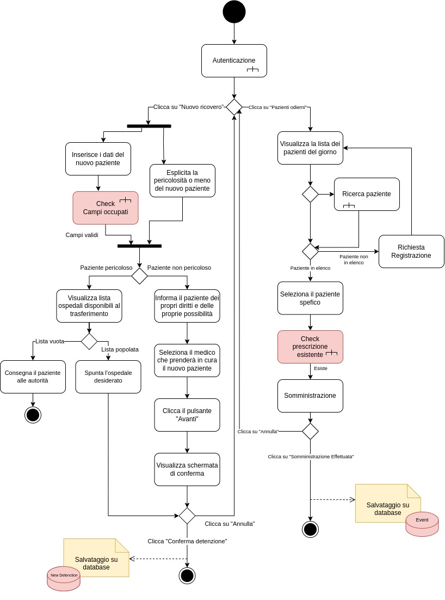
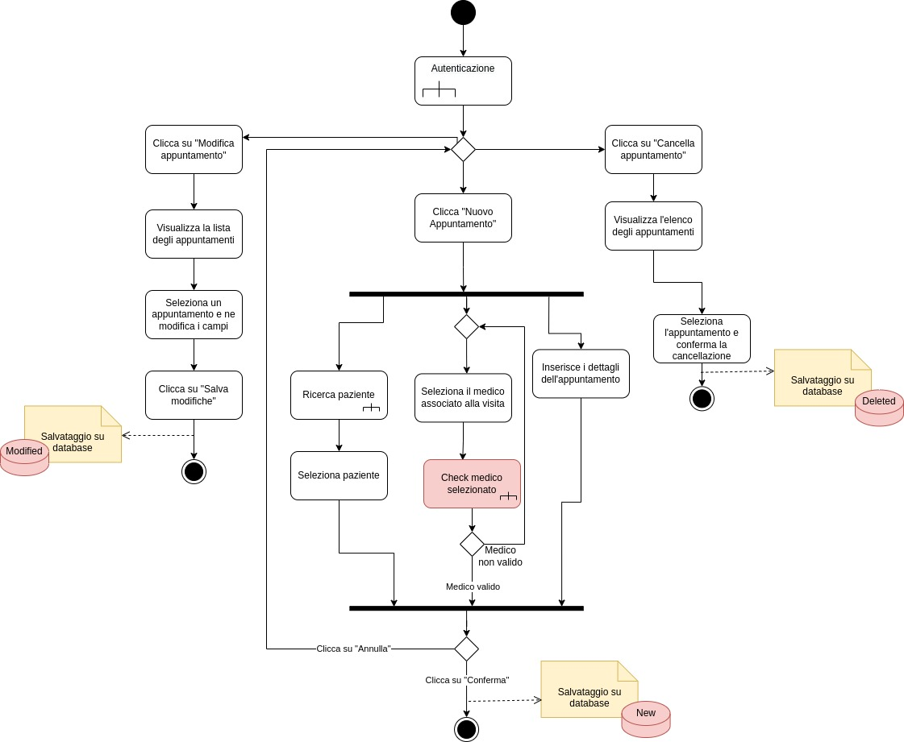

# _Mentcare Demo_

# Indice

# 1 - Introduzione

Mentcare è un sistema informativo utile per la gestione di cliniche che trattano pazienti con problemi di salute mentale.
Esso dovrà fornire un insieme di metodi e strumenti necessari per la raccolta, conservazione e utilizzo dei dati
correlati all'attività informativa di una o più cliniche responsabili di pazienti mentalmente instabili che non necessitano di ospedalizzazione.
Sono dunque presi in cura da cliniche specializzate dove possono trovare un dottore che conosce attentamente il loro stato clinico.
Il suo scopo è gestire lo scambio di informazioni fra le varie componenti interne attraverso una banca dati centrale.

# 2 - Background

## 2.1 - Processo di sviluppo software
*** QUESTA FASE LA SCRIVIAMO ALLA FINE DEL PROGETTO ***

In questa sezione riportiamo le fasi di sviluppo del sw e eventualmente particolari
scelte o condizioni in cui ci siamo trovati.

# 3 - Analisi dei requisiti

## 3.1 - Specifica

### 3.1.1 - Scenari

#### S1 - IL MEDICO EFFETTUA UNA NUOVA PRESCRIZIONE

Assunzione iniziale: Il medico effettua una prescrizione per uno o più pazienti da lui in cura; in particolare, tramite il login nel 
sistema, inserendo il codice ID a 8 cifre e la password di sicurezza, viene visualizzata la schermata principale.

Normale: il medico, una volta effettuato il login, clicca sul bottone "Visualizza Pazienti" in cui visualizza l'elenco dei pazienti da lui in cura dove sono presenti nome e cognome.
Il medico decide di visualizzare la cartella clinica del paziente a cui effettuare la prescrizione medica, così clicca sull'icona a forma di foglio in corrispondenza del nome.
Una volta visualizzata, il medico clicca sul bottone "Nuova Prescrizione Medica" e viene reindirizzato a una schermata per l'inserimento della nuova prescrizione medica unica relativa a quel paziente. 
Allora, su un campo di testo scrive le proprie indicazioni e tramite una schermata interna di ricerca digita il nome del farmaco che sta prescrivendo, 
seleziona il farmaco che sarà inserito nella prescrizione e in un campo di testo inserisce il dosaggio e frequenza.
Una volta completata la prescrizione medica conferma l'operazione cliccando sul bottone "Conferma" e un pop up gli chiede ulteriore conferma. 

Cosa può andare storto: 
- Il farmaco non è presente e cliccando su di esso appare una notifica di errore. 
- Il medico decide di non effettuare più la prescrizione, così cliccando sul pulsante "Annulla" l'operazione di 
  prescrizione viene annullata e viene reindirizzato alla schermata principale.
- Il medico vuole effettuare una nuova prescrizione a un paziente che già ne possiede una e viene allora visualizzata una schermata con la relativa notifica di errore.
- Il dosaggio non rientra nel range di sicurezza e il sistema genera una notifica di errore chiedendo d'inserire il valore atteso. 

Altre attività: il medico visualizza la lista dei farmaci appena prescritti al paziente e i relativi dosaggi e dopo aver visualizzato l'elenco dei 
pazienti e selezionato il paziente, clicca sul bottone "Visualizza Farmaci".

Stato di completamento: La nuova prescrizione è stata completata ed è visibile all'interno della cartella clinica.

#### S2 - IL MEDICO AGGIORNA UNA PRESCRIZIONE 

Assunzione iniziale: Il medico effettua un aggiornamento della prescrizione medica per uno o più pazienti da lui in cura;
effettua il login nel sistema inserendo il codice ID a 8 cifre e la password di sicurezza e viene visualizzata la schermata principale.

Normale: Il medico clicca sul bottone "Modifica Prescrizione" e viene visualizzato l'elenco dei pazienti da lui in cura 
con il rispettivo nome e cognome accanto al quale è presente un'icona a forma di martello. Il medico decide di effettuare l'aggiornamento
della prescrizione e clicca sull'icona. Viene così reindirizzato a una schermata per l'inserimento della modifica della prescrizione 
unica relativa al paziente. Il medico visualizza il campo di testo in cui sono presenti le indicazioni sulla prescrizione con i relativi 
farmaci prescritti, il loro dosaggio e frequenza. Allora modifica il campo di testo e il dosaggio cliccando su di essi e per eliminare
i farmaci prescritti clicca sul bottone "X" di fianco; il medico inoltre inserisce un nuovo farmaco interagendo con una
schermata interna di ricerca in cui digita il nome del farmaco in un'apposita barra e cliccando sul nome del nuovo farmaco 
sarà selezionato e inserito nella prescrizione. Una volta completato l'aggiornamento della prescrizione medica conferma l'operazione cliccando
sul bottone "Conferma" e un pop up gli chiede ulteriore conferma.

Cosa può andare storto:
- Il farmaco non è presente e cliccando su di esso appare una notifica di errore.
- Il medico decide di non effettuare più l'aggiornamento della prescrizione così clicca sul pulsante "Annulla", l'operazione di
aggiornamento viene annullata e viene reindirizzato alla schermata principale.
- Il dosaggio non rientra nel range di sicurezza allora il sistema genera una notifica di errore chiedendo d'inserire il valore atteso.

Altre attività: il medico visualizza la lista dei farmaci assunti dal paziente e i relativi dosaggi e, dopo 
aver visualizzato l'elenco dei pazienti e averlo selezionato, clicca sul bottone "Visualizza Farmaci".

Stato di completamento: L'aggiornamento della prescrizione è stato completato ed è visibile all'interno
della cartella clinica. 

#### S3 - Ingresso di un nuovo paziente in clinica

Assunzione iniziale: L'infermiere incaricato effettua il login inserendo il codice identificativo otto cifre
e la propria password e viene visualizzata la schermata principale.

Normale: L’infermiere clicca sul bottone “Nuovo ricovero” e viene visualizzata una schermata in cui inserisce gli 
estremi del paziente e lo stato di pericolosità spuntando o meno la casella “Paziente pericoloso". Il paziente non 
pericoloso viene informato dei propri diritti inerenti il ricovero e le proprie azioni; successivamente l’infermiere 
inserisce i dati anagrafici, seleziona il medico che lo riceverà in cura e clicca sul bottone “Avanti” e un pop 
up chiede conferma di detenzione. L’infermiere, fatto ciò, clicca sul bottone “Conferma detenzione” registrando così la decisione 
di detenzione. Il paziente viene allora ricoverato nella clinica e un messaggio di notifica di detenzione con le 
informazioni rispettivamente del paziente e del medico curante viene inviata ai servizi sociali e al medico che lo avrà in cura.

Cosa può andare storto:
- L’infermiere decide di annullare l’operazione di ricovero forzato, clicca sul tasto “Annulla” e 
viene reindirizzato alla schermata principale;
- L’infermiere non inserisce un campo dei dati anagrafici, una notifica di errore viene generata e cliccando su “Ok” 
viene reindirizzato alla schermata per il nuovo inserimento dei dati anagrafici.

Altre attività:
- L’infermiere deve ricoverare un paziente pericoloso, allora spunta la casella “Paziente pericoloso”. L’infermiere 
clicca sul bottone “Avanti” e una schermata gli mostra gli ospedali disponibili per la cura del paziente. 
In questa schermata, spunta l’ospedale, clicca su “Conferma detenzione” e una notifica di trasferimento viene inviata all'ospedale selezionato.
- L’infermiere deve ricoverare un paziente pericoloso e spunta la casella “Paziente pericoloso”. L’infermiere 
clicca sul bottone “Avanti” e una schermata mostra che non c'è alcun ospedale disponibile in cui poter effettuare 
il trasferimento del paziente. Così, un pop up notifica la mancata disponibilità degli ospedali. Nel caso in cui l'infermiere 
conferma la detenzione, cliccando su “Conferma Detenzione” una notifica di trasferimento viene inviata alla stazione di polizia
che preleva il paziente.

Stato di completamento: La procedura di ricovero forzato è stata completata e il nuovo paziente e suoi dati 
sono visibili e reperibili negli elenchi a disposizione del personale medico; inoltre, viene aggiornato lo storico 
“notifiche inviate” visibile dal personale amministrativo e lo storico “Notifiche ricevute" visibile dal medico che 
riceve in cura il paziente.

#### S4 - Un infermiere deve somministrare un farmaco a un paziente

Assunzione iniziale: L'infermiere incaricato effettua il login inserendo il codice identificativo a otto cifre
e la propria password e viene visualizzata la schermata principale.

Normale: L'infermiere clicca sul bottone “Pazienti odierni”, visualizza l’elenco dei pazienti oggi in visita in struttura e 
seleziona il paziente con un click. Dopo visualizza il farmaco da somministrare e ne vede la disponibilità, in tal caso inserisce 
la dose da somministrare e la frequenza di dosaggio. L’infermiere somministra il farmaco e clicca sul bottone 
“Somministrazione effettuata”. Allora un pop up chiede all’infermiere conferma dell’operazione.  

Cosa può andare storto:
- Il paziente non è il elenco e deve essere effettuata la registrazione.
- Il paziente non possiede nessuna prescrizione clinica e deve essere sottoposto a una visita medica con relativa prescrizione.

Altre attività: 
- L'infermiere non effettua l'attività di somministrazione. Clicca sul pulsante "Annulla", l’operazione non viene confermata 
e lo stato della “Somministrazione odierna” non viene modificato. Viene visualizzato un pallino rosso vicino la voce 
"Somministrazione odierna" e il sistema ritorna all’elenco dei pazienti odierni.

Stato di completamento: Se l'infermiere clicca sul pulsante "Conferma" l’operazione viene confermata, il campo 
“somministrazione odierna” viene settato con un pallino verde vicino la voce e il sistema ritorna all’elenco dei pazienti odierni.

#### S5 - Il personale della clinica ricerca un paziente nel sistema 

Assunzione iniziale: L'utente del personale della clinica effettua il login inserendo il codice identificativo ad otto cifre
e la propria password e viene visualizzata la schermata principale.

Normale: L'utente clicca sulla barra di ricerca e digita il nome del paziente che intende ricercare; automaticamente
una lista con tutti i pazienti aventi quel nome e/o cognome viene visualizzata nella schermata. L'utente seleziona il paziente
ricercato e visualizza le sue generalità in una nuova finestra. 

Cosa può andare storto: 
- La ricerca del paziente non produce alcun risultato poiché l'utente ha digitato non correttamente nome e/o cognome oppure
il paziente non è stato registrato nel sistema della clinica.

Altre attività: 
- L'infermiere effettua la ricerca di un paziente appartenente alla clinica, così selezionando il paziente ricercato visualizza 
le sue generalità, i farmaci assunti e la cartella clinica.  
- Il medico effettua la ricerca di un paziente da lui in cura, seleziona il paziente ricercato in modo da visualizzare le sue generalità, i farmaci
  assunti, la cartella clinica e gli appuntamenti.
- Il receptionist effettua la ricerca di un paziente appartenente alla clinica e selezionando il paziente ricercato visualizza
  le sue generalità e gli appuntamenti. 

Stato di completamento: l'utente ha effettuato la ricerca, chiude la finestra con le informazioni del paziente e viene 
reindirizzato alla schermata principale.

#### S6 - Il paziente visualizza il proprio status clinico 

Assunzione iniziale: Un paziente effettua il login inserendo il proprio username e la propria password e viene visualizzata 
la schermata principale.

Normale: Il paziente tramite la schermata principale clicca su bottone "Visualizza appuntamenti", compare una finestra
e viene visualizzato l'elenco di tutti gli appuntamenti.

Altre attività:
- Il paziente visualizza la lista dei propri farmaci da assumere, con i relativi dosaggi, andando a cliccare sul bottone 
"Visualizza Farmaci". 
- Il paziente visualizza il nome del medico che lo ha in cura andando a cliccare sul bottone "Visualizza medico".

Stato di completamento: Il paziente ha visualizzato i propri appuntamenti, chiude la finestra cliccando sul bottone "Chiudi"
e viene reindirizzato alla schermata principale.

#### S7 - Il receptionist registra un nuovo appuntamento.

Assunzione iniziale: Il receptionist effettua il login inserendo il codice identificativo a otto cifre e la propria password 
e viene visualizzata la schermata principale.

Normale: Il receptionist inserisce un nuovo appuntamento e clicca sul pulsante "Nuovo Appuntamento". 
Una volta effettuato il click compare una schermata all'interno della quale viene chiesto d'inserire il codice fiscale del 
paziente e tramite un menù a tendina seleziona il medico che effettuerà la vista; cliccando sul pulsate "Continua", viene reindirizzato in una
pagina in cui inserisce i dettagli dell’appuntamento (giorno, mese, anno, ora). Il receptionist conferma l'operazione 
cliccando sul bottone "Conferma".

Cosa può andare storto: 
-  Il receptionist inserisce in modo errato il codice fiscale e compare un messaggio di errore in cui viene richiesto
d'inserire nuovamente il codice fiscale corretto;
- Il receptionist inserisce correttamente il codice fiscale ma non seleziona il medico che effettua la visita; il 
sistema genera un pop up con un messaggio di errore in cui viene segnalata la selezione del medico.
- Il receptionist inserisce l'appuntamento per un paziente non registrato nel sistema della clinica e al momento
della conferma un pop up notifica l'errore.
- Il receptionist inserisce l'appuntamento per un paziente in una fascia oraria occupata e al momento
della conferma dell'appuntamento un pop up notificherà l'errore.

Altre attività: 
- Il receptionist cancella un appuntamento, clicca sul bottone "Cancella appuntamento" e si apre una schermata
in cui vengono visualizzati tutti gli appuntamenti con il relativo nome, cognome e codice fiscale del paziente. Cliccando su un 
determinato appuntamento, un pop up chiede la conferma della cancellazione.
- Il receptionist modifica un appuntamento e cliccando sul bottone "Modifica appuntamento", si apre una schermata
in cui vengono visualizzati tutti gli appuntamenti con il relativo nome, cognome e codice fiscale del paziente. Cliccando
 su un determinato appuntamento, una schermata mostra quell'appuntamento con i campi "giorno", "mese", "anno", "ora", "medico" modificabili.
Dopo le modifiche, clicca sul pulsante "Salva modifiche".

Stato di completamento:
Il receptionist ha effettuato l'operazione di registrazione dell'appuntamento e appare una schermata di riepilogo in cui
cliccando su "Ok" viene reindirizzato alla schermata principale e l'appuntamento viene reso visibile nel sistema.

#### S8: Lo staff di amministrazione inserisce un nuovo utente nel sistema (medico, paziente, infermiere)

Assunzione iniziale: Un membro dello staff di amministrazione effettua il login inserendo il codice identificativo a otto cifre e la propria password
e viene visualizzata la schermata principale.

Normale: Un membro dello staff di amministrazione registra un nuovo utente nel sistema e clicca sul pulsante 
"Nuova utente". Una volta effettuato il click compare una schermata in cui il membro dello staff inserisce
negli appositi campi di testo le generalità del nuovo utente come nome, cognome, data di nascita, luogo di nascita e 
codice fiscale. 
Inoltre nella schermata sono presenti i tre campi "paziente, medico, infermiere", il membro dello staff spunta il campo 
che identifica la tipologia del nuovo utente da registrare e clicca sul pulsante "Avanti", allora apparirà una notifica 
di conferma registrazione utente e il membro dello staff clicca su "Conferma". 

Cosa può andare storto:
- Il membro dello staff deve annullare la registrazione utente perché ha inserito dei dati errati
o per altri motivi, clicca allora sul pulsante "Annulla".
- Il membro dello staff inserisce un codice fiscale già presente nel sistema, un pop up notificherà l'errore "Codice fiscale 
esistente".

Altre attività:
- Il membro dello staff registra un medico, ha allora inserito la spunta nel campo "medico", sulla schermata comparirà 
un nuovo campo d'inserimento testo in cui inserire la professione medica. 

Stato di completamento: 
Il membro dello staff di amministrazione ha effettuato la registrazione del nuovo utente e il codice ID a otto cifre
associati all'utente e la password generate automaticamente dal sistema sono salvate sul sistema. 

#### S9 - Un membro dello staff di amministrazione visualizza un report mensile 

Assunzione iniziale: Un membro dello staff di amministrazione effettua il login inserendo il codice identificativo a 
otto cifre e la propria password e viene visualizzata la schermata principale.

Normale: Un membro dello staff di amministrazione clicca sul pulsante "Report mensile" e tramite una nuova schermata visualizza
l'elenco delle mensilità ordinate per anno, cliccando su una delle mensilità visualizza il report contenente:
- il numero dei pazienti inseriti e cancellati nel sistema;
- numero farmaci per nome
- costo complessivo farmaci

Altre attività: 
- Il membro dello staff di amministrazione una volta visualizzato il report clicca sul pulsante "Dettagli pazienti" e visualizza
l'elenco dei pazienti 
- Il membro dello staff di amministrazione una volta visualizzato il report clicca sul pulsante "Dettaglio costo farmaci" 
e visualizza il costo dei singoli farmaci

Stato di completamento:
Il membro dello staff di amministrazione ha visualizzato il report mensile.

## 3.1.2 - Stakeholder

Gli attori partecipanti al sistema sono:

- Pazienti
- Dottori
- Infermieri
- Addetti alla reception
- Staff di amministrazione

### 3.1.3 - Requisiti funzionali per attori

(a) Medici

- (a.1) Un medico può aggiornare la prescrizione dei farmaci di ogni paziente da lui in cura (S2)
- (a.2) Un medico può prescrivere farmaci a ogni paziente da lui in cura (S1)
- (a.3) Un medico può visualizzare la cartella clinica del paziente (S1)
- (a.4) Un medico può visualizzare la lista di farmaci somministrati da ogni paziente da lui in cura (S1)
- (a.5) Un medico può visualizzare la lista dei propri appuntamenti (S6)
- (a.6) Un medico può ricercare l'appuntamento con un determinato paziente inserendo il relativo codice fiscale (S6)
- (a.7) Un medico può inserire i farmaci a un paziente a lui associato (S1)
- (a.8) Un medico può effettuare una ricerca solo dei propri pazienti visualizzando le loro generalità, farmaci assunti e
cartella clinica 

(b) Infermieri

- (b.1) Un infermiere può visualizzare la lista con le informazioni di tutti i suoi pazienti (S4)
- (b.2) Un infermiere ha la possibilità di cercare i pazienti in base al codice fiscale (S4)
- (b.3) Un infermiere può visualizzare la lista di farmaci assunti da ogni paziente (S4)
- (b.4) Un infermiere può registrare la detenzione di un nuovo paziente (S3)
- (b.5) Un infermiere può effettuare una ricerca solo dei propri pazienti visualizzando le loro generalità, farmaci assunti e
  cartella clinica

(c) Pazienti
- (c.1) Un paziente può visualizzare il proprio calendario farmacologico
- (c.2) Un paziente può visualizzare la lista dei propri appuntamenti sul calendario
- (c.3) Un paziente può visualizzare le dosi che deve assumere per ogni farmaco avendo la possibilità di filtrare ogni farmaco in base al nome

(d) Addetto alla reception
- (d.1) Un receptionist può registrare gli appuntamenti dei pazienti 
- (d.2) Un receptionist può modificare gli appuntamenti di un paziente
- (d.3) Un receptionist può cancellare gli appuntamenti di un paziente
- (d.4) Un receptionist può visualizzare la lista di tutti gli appuntamenti filtrando le ricerche inserendo l'id del paziente
- (d.5) Un receptionist può effettuare una ricerca di tutti i pazienti all'interno della clinica visualizzando solamente 
le loro generalità. 

(e) Staff di amministrazione
- (e.1) Un membro dello staff di amministrazione può registrare un nuovo utente
- (e.2) Un membro dello staff di amministrazione può visualizzare un report mensile
- (e.3) Un membro dello staff di amministrazione può specificare la specializzazione del medico 

### 3.1.4 Requisiti funzionali di sicurezza e safety

- Il sistema deve garantire la protezione dei dati coperti da privacy in modo che solamente lo staff medico e il paziente
possano avervi accesso;
- Ogni membro dello staff deve essere identificato da un codice univoco di 8 cifre;
- Il sistema effettua un controllo sulle dosi dei farmaci basandosi su un range di sicurezza. In caso di errore la dose deve essere reinserita;
- Se il paziente soffre di allergie particolari il sistema deve rispondere alla somministrazione di un farmaco scorretto con un messaggio di warning
e se la figura che prescrive ignora il messaggio di warning.
- Il sistema per ogni nuovo utente generato crea un codice ID univo.

### 3.1.5 Altri requisiti funzionali

- Ogni farmaco deve possedere i campi 'Maximum dose' e 'Minimum dose';
- Il sistema genera un report mensile mostrando il numero di pazienti per clinica, il numero dei pazienti inseriti o cancellati 
dal sistema,il numero di pazienti per tipologia, i farmaci loro prescritti ed i relativi costi, questo l'ultimo giorno *lavorativo* del mese, dopo le 17:30;
- Il report deve contenere anche le seguenti informazioni: nomi dei farmaci,numero di prescrizioni,numero di dosi prescritte e costi totali delle dosi prescritte;
- Se il report ha dosi di differenti unità, il sistema deve registrarle in report separati per ogni unità.

### 3.1.6 Requisiti non funzionali

- Il sistema Mentcare dove essere disponibile a tutte le cliniche durante le normali ore lavorative (LUN-VEN 8:30-17:30);
- Il sistema Mentcare genera alla fine di ogni mese, dopo le 17:30, un report sotto forma di raccolta dati;
- Lo staff medico deve potersi autenticare con il proprio codice identificativo a 8 cifre e la rispettiva password;
- Il sistema deve rispettare le linee guida per la privacy in HStan-03-2006-priv;
- Gli appuntamenti devono differenziarsi per fascia oraria di minimo 20 minuti l'uno dall'altro (S7).

## 3.2 - Diagrammi di casi d'uso

### 3.2.1 - Casi d'uso del Medico

### 3.2.2 - Casi d'uso dell'infermiere

### 3.2.3 - Casi d'uso del paziente

### 3.2.4 - Casi d'uso dell' addetto alla reception

### 3.2.5 - Casi d'uso dello staff di amministrazione

### 3.2.6 - Casi d'uso degli infermieri a domicilio

## 3.3 - Definizione degli stati del sistema

Una volta definiti degli stati o delle operazioni chiave fatti dagli utenti,
è possibile attribuire responsabilità ai vari utenti di queste ultime.

IPOTESI DI ALE CIRCA GLI STATI DEL SISTEMA CHE POTREBBERO IN FASE DI IMPLEMENTAZIONE E TEST AIUTARCI 
A CAPIRE COME EVOLVE IL SISTEMA:

Il sistema ruota tutto attorno alle prescrizioni, per cui potrebbero essere alcuni stati possibili
- CREATED (Settato al momento della creazione)
- MODIFIED (Modificata in corso d'opera)
- ISPECTIONED (Se subisce ispezioni di polizia)
- DELETED (Cancellata in corso d'opera)
- CLOSED (Chiusa perchè conclusa)

## 3.4 - Creazione Test di accettazione

Definiamo a priori i test di accettazione per poter consegnare ad un ipotetico stakeholder un progetto funzionante secondo accordi presettati.

# 4 - Design architetturale

In questa sezione definiamo COME appare il sistema ipoteticamente prima di una possibile implementazione.

## 4.1 - Scelta dell'architetturale

Se modello Client-server oppure MVC (consiglio MVC).
MVC = Model View Controller

Model = Oggetti come entità statiche (i dati)
View = Vista, ovvero il frontend
Controller = tutta la parte dinamica e comportamentale (variazioni di stato)

Se la view è il frontend il controller è il backend.
Consiglio mio, attuare forme di sicurezza nel backend.

## 4.2 Activity Diagram

Questo diagramma enuncia tutte le possibili strade percorribili dall'esecuzione
(Da decidere quali tipi di errore possibili specificare).

### 4.2.1 - Fase di Login

Di seguito vengono rappresentate le attività svolte durante la fase di login.

### 4.2.2 - Fase di registrazione di un nuovo utente

### 4.2.3 - Operazioni del medico

### 4.2.4 - Operazioni dell'infermiere

### 4.2.5 - Operazioni del paziente

### 4.2.6 - Operazioni dello staff di amministrazione

### 4.2.7 - Operazioni dell' addetto alla reception

### 4.2.8 - Diagramma delle attività di controllo

### 4.2.9 - Diagramma delle sotto-attività

## 4.3 - Class Diagram

Questo diagramma presenta la struttura del progetto suddivisa in classi.
(Consiglio mio: abbondare di classi diverse e non classi enormi singole).

## 4.4 - Sequence Diagram

Questo diagramma a vari livelli di dettaglio (logica astratta e/o metodi interni) spiega come avviene lo scambio di messaggi tra gli interlocutori (attori e sistema o attori e componenti di sistema).

## 4.5 - Mock up d'interfaccia grafica

In questa sezione presentiamo come vorremmo mostrare l'interfaccia grafica.
Poi l'esito è deciso dall'implementazione del frontend e quindi si potrebbe distaccare non poco.
Draw.io possiede i bottoni e icone utili.
Consiglio di guardarsi i componenti di vaadin (open source).

# 5 - Implementazione e Testing di unità

In questa fase conviene scrivere il codice E contemporaneamente scrivere i test relativi ad ogni metodo (metodo1->test1->metodo2-->..) in modo da avere sott'occhio una realizzazione valida (e quindi sicura sotto certi punti di vista).

## 5.1 - Implementazione delle funzionalità

## 5.1.1 - Entità

Codice della parte model spiegato

## 5.1.2 - Controllers

Codice nelle varie classi controller

## 5.1.3 - View

Codice del frontend

## 5.1.4 - Errori

Codice rigardante possibili errori definti come classi

## 5.2 - Implementazione della sicurezza

## 5.2.1 - Implementazione dei checker
I checker controllano se l'utente che sta agendo ha i permessi per poter fare quella determinata operazione

## 5.2.n ...

## 5.3 - Testing di unità

In questa fase raccontiamo l'esperienza ottenuta dai test dei singoli metodi e delle singole parti suddivise del sistema(per attori oppure per requisiti eccetera)

## 5.4 - Testing di accettazione

Conclusione della realizzazione del progetto attraverso una fase di test più generici, mirati a svolgere tutti i possibili scenari del progetto e colpire il sistema per mandarlo in errore/violare determinate vulnerabilità

# Bibliografia

Io qui ci metterei i vari link
- [Java Spring Tutorial](https://spring.io/guides/tutorials/rest/)
- [Vaadin Components](https://vaadin.com/docs/latest/components)

